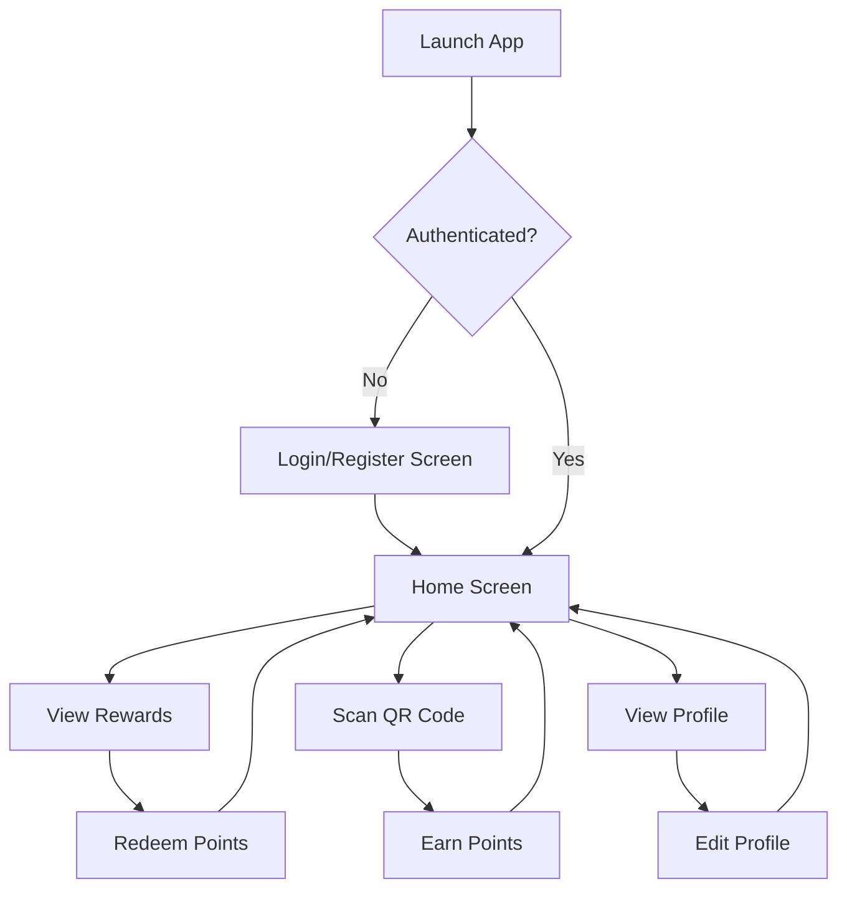

# Mobile Loyalty App

A modern **React Native** application for managing and rewarding customer loyalty.  
Bootstrapped with [`@react-native-community/cli`](https://github.com/react-native-community/cli).

---

## Table of Contents

- [Overview](#overview)
- [Architecture](#architecture)
- [Features](#features)
- [Demo](#demo)
- [Getting Started](#getting-started)
- [Troubleshooting](#troubleshooting)
- [Learn More](#learn-more)
- [Contributing](#contributing)

---

## Overview

The **Mobile Loyalty App** enables businesses to reward their customers with points, discounts, and special offers.  
Customers can track their loyalty status, redeem rewards, and receive personalized promotions.

---

## Architecture

The app follows a modular architecture for scalability and maintainability.

```
App (React Native)
│
├── Presentation Layer (UI Components, Screens)
│
├── State Management (Redux / Context API)
│
├── Services (API, Storage, Notifications)
│
└── Data Layer (Models, DTOs)
```

> **Note:** Replace with your actual architecture diagram if available.

---

### App Flow Diagram

Below is a high-level flow of how users interact with the app:



- **Launch App**: User opens the app.
- **Authentication**: If not logged in, user is prompted to log in or register.
- **Home Screen**: Central hub for navigation.
- **Rewards/QR/Profile**: Users can view rewards, scan QR codes to earn points, or manage their profile.
- **Redeem/Earn/Edit**: Actions loop back to the Home Screen.

---

## Features

- User authentication & registration
- Earn and redeem loyalty points
- View transaction history
- Personalized offers & notifications
- QR code scanning for quick rewards
- Multi-platform support (iOS & Android)

---

## Demo

### 🎬 Video Demo

<!-- Place your video demo link or embedded video here -->
[](https://your-demo-video-link.com)

### 🖼️ Screenshots

<!-- Add screenshots of your app below -->
| Home Screen | Rewards | QR Scanner |
|-------------|---------|------------|
|  |  |  |

---

## Getting Started

### Prerequisites

- [Node.js](https://nodejs.org/)
- [Yarn](https://yarnpkg.com/) or [npm](https://www.npmjs.com/)
- [React Native CLI](https://reactnative.dev/docs/environment-setup)
- [Android Studio](https://developer.android.com/studio) and/or [Xcode](https://developer.apple.com/xcode/) for emulators

### 1. Install Dependencies

```sh
yarn install
# or
npm install
```

### 2. Start Metro Bundler

```sh
yarn start
# or
npm start
```

### 3. Run the App

#### Android

```sh
yarn android
# or
npm run android
```

#### iOS

Install CocoaPods dependencies (first time or after native deps update):

```sh
cd ios && pod install && cd ..
```

Then run:

```sh
yarn ios
# or
npm run ios
```

---

## Troubleshooting

If you encounter issues, refer to the [React Native Troubleshooting Guide](https://reactnative.dev/docs/troubleshooting).

---

## Learn More

- [React Native Docs](https://reactnative.dev/docs/getting-started)
- [Integration Guide](https://reactnative.dev/docs/integration-with-existing-apps)
- [Blog](https://reactnative.dev/blog)
- [@facebook/react-native GitHub](https://github.com/facebook/react-native)

---

## Contributing

We welcome contributions! Please open issues or submit pull requests.

1. Fork the repository
2. Create your feature branch (`git checkout -b feature/YourFeature`)
3. Commit your changes (`git commit -am 'Add new feature'`)
4. Push to the branch (`git push origin feature/YourFeature`)
5. Open a pull request

---

**Happy Coding! 🚀**
