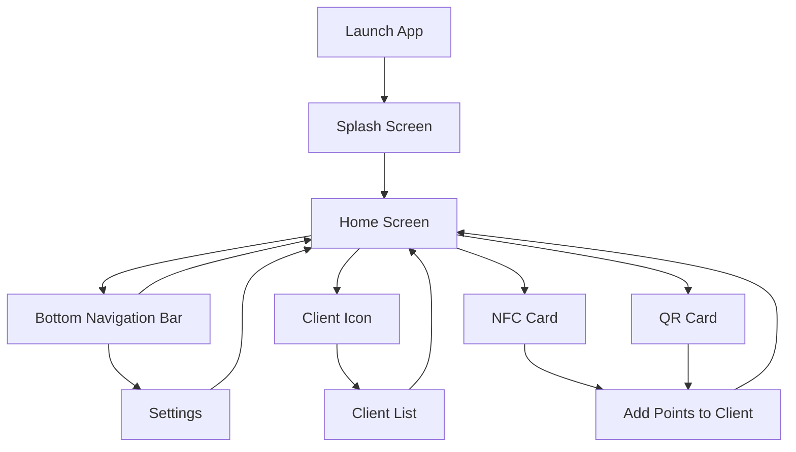

# Mobile Loyalty App

A modern **React Native** application for managing and rewarding customer loyalty. Bootstrapped with [`@react-native-community/cli`](https://github.com/react-native-community/cli).


<div align="center">

  

</div>

---

## Table of Contents

- [Overview](#overview)
- [Architecture](#architecture)
- [Features](#features)
- [Demo](#demo)
- [Getting Started](#getting-started)
- [Troubleshooting](#troubleshooting)
- [Learn More](#learn-more)

---

## Overview

The **Mobile Loyalty App** enables businesses to reward their customers with points, discounts, and special offers.  
Customers can track their loyalty status, redeem rewards, and receive personalized promotions.

---

## Architecture

The app follows a modular architecture for scalability and maintainability.

```
App (React Native)
│
├── Presentation Layer (UI Components, Screens)
│
├── State Management (Redux / Context API)
│
├── Services (API, Storage, Notifications)
```

---

### App Flow Diagram

Below is a high-level flow of how users interact with the app:



- **Launch App**: User opens the app.
- **Splash Screen**:  Brief loading screen displayed after launch.
- **Home Screen**: Main hub for user interaction, shown after the splash screen.
- **Bottom Navigation Bar**: Allows navigation between Home and Settings screens.
- **Client Icon**: Located on the Home Screen; tapping it opens the Client List.
- **NFC Card / QR Card**: Tapping either option takes the user to the Add Points to Client screen.
- **Client List / Add Points / Settings**: After completing actions, the user is returned to the Home Screen.


---

## Demo

### 🖼️ Screenshots

<div align="center">
  


</div>

---

### 🎬 Video Demo


https://github.com/user-attachments/assets/cadea92e-997e-4b02-97f7-a2794e1e05c7


## Getting Started

### Prerequisites

- [Node.js](https://nodejs.org/)
- [Yarn](https://yarnpkg.com/) or [npm](https://www.npmjs.com/)
- [React Native CLI](https://reactnative.dev/docs/environment-setup)
- [Android Studio](https://developer.android.com/studio) and/or [Xcode](https://developer.apple.com/xcode/) for emulators

### 1. Install Dependencies

```sh
yarn install
# or
npm install
```

### 2. Start Metro Bundler

```sh
yarn start
# or
npm start
```

### 3. Run the App

#### Android

```sh
yarn android
# or
npm run android
```

#### iOS

Install CocoaPods dependencies (first time or after native deps update):

```sh
cd ios && pod install && cd ..
```

Then run:

```sh
yarn ios
# or
npm run ios
```

---

## Troubleshooting

If you encounter issues, refer to the [React Native Troubleshooting Guide](https://reactnative.dev/docs/troubleshooting).

---

## Learn More

- [React Native Docs](https://reactnative.dev/docs/getting-started)
- [Integration Guide](https://reactnative.dev/docs/integration-with-existing-apps)
- [Blog](https://reactnative.dev/blog)
- [@facebook/react-native GitHub](https://github.com/facebook/react-native)

---

**Happy Coding! 🚀**
